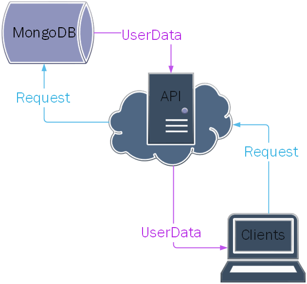
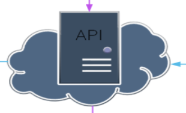

# OctaneFlaskAPI
This is the home to the OctaneAPI. This porject is designed to interact as the backend for user data. An API to poth PUt and GET data from the database as a way of making the entire project more flexible.

 
 
 

# Project Scope

This is the overall scope of the entire project. However, the focal point of the code designated in this repository aims to explain, literally, the central part of this project. The API: 

 
 
 

# The focus of this repo

This repo is home to the code of this projects API, our **Application Programming Interface**. This is to allow any client to request user information from the database set up to house all of the user data. It's also our gateway of updating data in the database.

# Security
The security of this API is set around JSON Web Token (JWTs). See Issue #3 for the expected workflow of developing the client authentication. See [Token based authentication with flask](https://realpython.com/token-based-authentication-with-flask/) for a more in-depth analysis of what went into creating this. If any vulnerabilities or other types of problems emurge from this, please open a new issue with the word "Security" in the title.
### [Rate limiting](https://nordicapis.com/everything-you-need-to-know-about-api-rate-limiting/) is also something I wanted to tack onto here.
This is a seperate field from security, but it does also play a role in security of the server. This will be an enhancement of security, rather then a subset, but it should still be mentioned. The [Flask-Limiter](https://flask-limiter.readthedocs.io/en/stable/#quick-start) will be used to handle most of the rate limiting.

